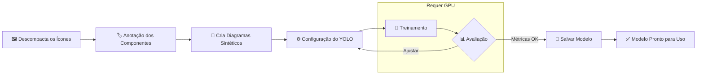
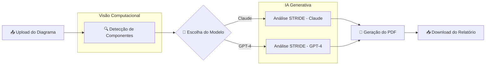

# 🛡️ STRIDE Vision

**Gerador automatizado de Relatórios de Modelagem de Ameaças baseado na metodologia STRIDE**

O STRIDE Vision combina visão computacional e inteligência artificial generativa para automatizar a análise de segurança de arquiteturas de software. Basta fazer upload de um diagrama de arquitetura e o sistema identifica os componentes, analisa as ameaças potenciais e gera um relatório profissional em PDF.

---

## 📋 Sobre o Projeto

Este projeto foi desenvolvido como parte do **Tech Challenge 5** da pós-graduação **Pós Tech - IA para Devs** da **FIAP**.

### Problema

A modelagem de ameaças é uma prática essencial em segurança da informação, mas demanda tempo e expertise. Muitas empresas não possuem analistas de segurança dedicados, deixando suas arquiteturas vulneráveis a riscos não mapeados.

### Solução

O STRIDE Vision automatiza esse processo:

1. **Detecta** componentes em diagramas de arquitetura usando visão computacional (YOLO)
2. **Analisa** ameaças potenciais usando IA generativa (Claude ou GPT-4)
3. **Gera** relatórios profissionais em PDF seguindo a metodologia STRIDE da Microsoft

---

## 🎯 Público-Alvo

- **Analistas de Segurança**: Ferramenta de apoio para acelerar modelagens de ameaças
- **Empresas sem equipe de segurança dedicada**: Solução acessível para identificar vulnerabilidades
- **Times de desenvolvimento**: Integração de segurança no ciclo de desenvolvimento

---

## 🛠️ Tecnologias Utilizadas

| Tecnologia | Finalidade |
|------------|------------|
| **YOLOv8** | Detecção de componentes em diagramas |
| **Claude (Anthropic)** | Análise de ameaças e geração de relatório |
| **GPT-4o (OpenAI)** | Alternativa para análise de ameaças |
| **WeasyPrint** | Conversão de Markdown para PDF |
| **Google Colab** | Ambiente de execução |

---

## 📦 Instalação

O projeto foi desenvolvido para rodar no **Google Colab**.   
Basta abrir o notebook e executar as células.

---

## 🔄 Fluxo de Funcionamento

### Fluxo de Treinamento do Modelo

> ⚠️ **Requisito**: GPU é necessária para treinamento. No Google Colab, vá em `Runtime > Change runtime type > GPU`.

Caso vc queira teinar o modelo com novos ícones/elementos, use a seguinte estrutura:
```
icons.zip
├── aws/
│   ├── EC2.png
│   ├── S3.png
│   └── ...
├── azure/
│   ├── VirtualMachine.png
│   └── ...
└── outro-provedor/
    ├── Componentes.png
    └── ...
```



### Fluxo de Uso (Inferência)

---

## 📊 Estrutura do Relatório

O relatório gerado inclui:

- **Sumário Executivo**: Visão geral das ameaças identificadas
- **Arquitetura Analisada**: Lista de componentes detectados
- **Matriz de Ameaças STRIDE**: Tabela detalhada com:
  - ID da ameaça
  - Componente afetado
  - Categoria STRIDE (S/T/R/I/D/E)
  - Cenário de ataque
  - Impacto
  - Mitigação recomendada
  - Prioridade (Crítica/Alta/Média/Baixa)
- **Resumo por Prioridade**: Agrupamento das ameaças
- **Recomendações Prioritárias**: Top 5 ações de mitigação
- **Próximos Passos**: Ações sugeridas

---

## 🔐 Metodologia STRIDE

| Letra | Categoria | Descrição |
|-------|-----------|-----------|
| **S** | Spoofing | Falsificação de identidade |
| **T** | Tampering | Adulteração de dados |
| **R** | Repudiation | Negação de ações realizadas |
| **I** | Information Disclosure | Vazamento de informações |
| **D** | Denial of Service | Negação de serviço |
| **E** | Elevation of Privilege | Elevação de privilégios |

---

## 💻 Requisitos de Hardware

| Cenário | GPU Necessária? |
|---------|-----------------|
| **Treinar novo modelo** | ✅ Sim - Recomendado GPU |
| **Usar modelo treinado** (inferência) | ❌ Não - CPU é suficiente |

---

## 📁 Estrutura do Projeto
```
stride-vision/
├── techchallenge5.ipynb     # Notebook principal
├── modelo/                  # Modelo YOLO treinado
├── exemplos/                # Diagramas de exemplo
└── README.md
```

---

## 👥 Autores

Desenvolvido por alunos da **Pós Tech - IA para Devs** da **FIAP**.

---

## 📄 Licença

Este projeto foi desenvolvido para fins acadêmicos como parte do Tech Challenge 5 da FIAP.

---

## 🙏 Agradecimentos

- **FIAP** pela oportunidade de aprendizado
- **Microsoft** pela metodologia STRIDE
- **Anthropic** e **OpenAI** pelas APIs de IA generativa
- **Ultralytics** pelo YOLOv8
